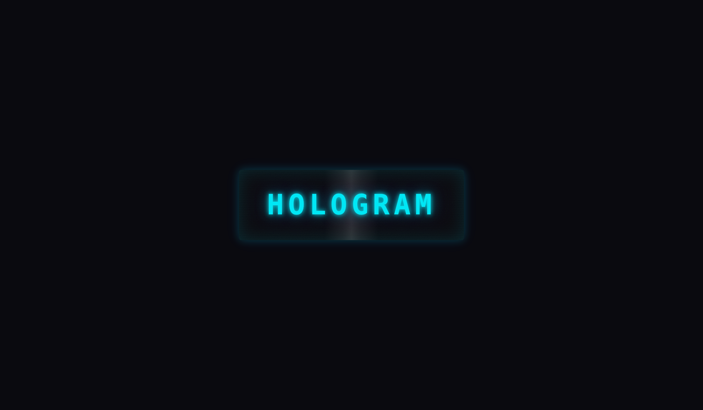
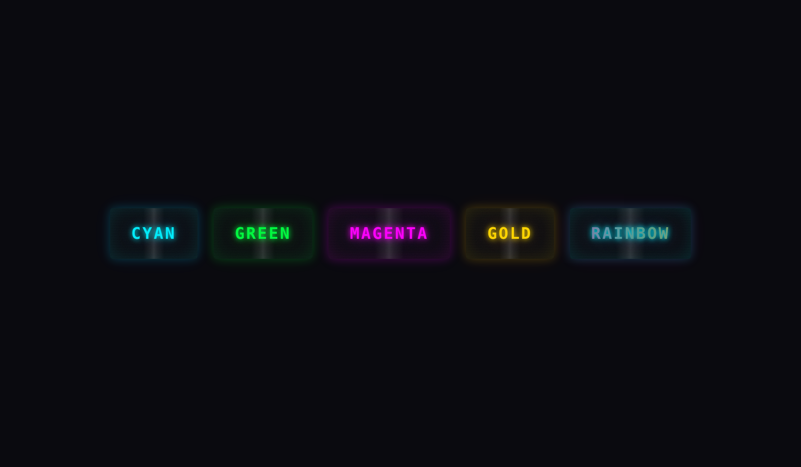
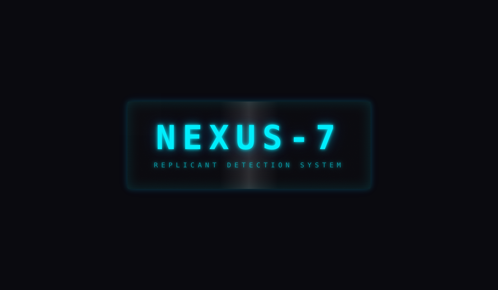
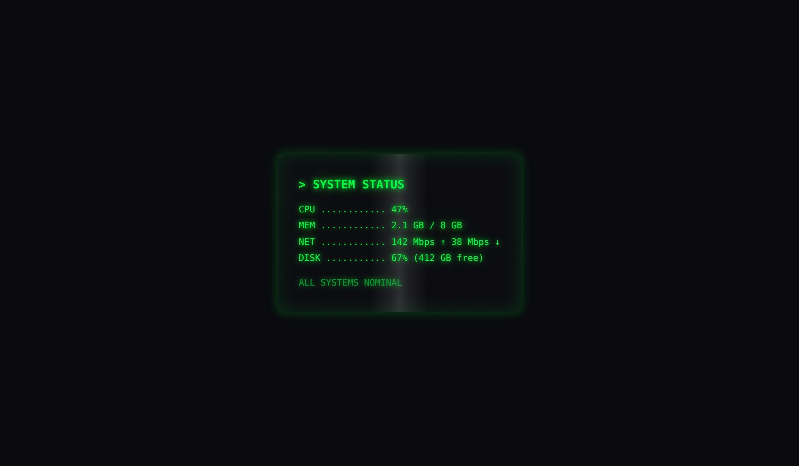
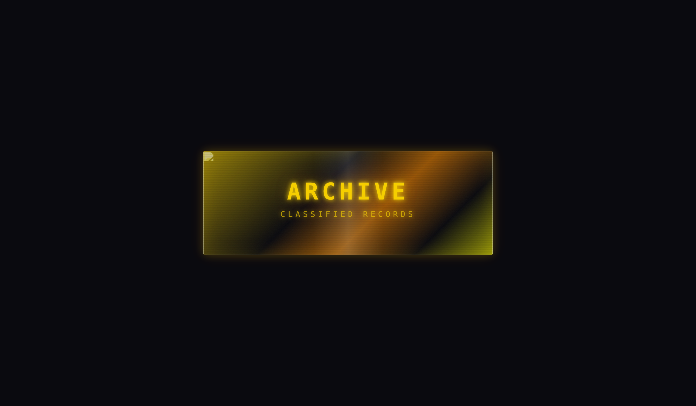
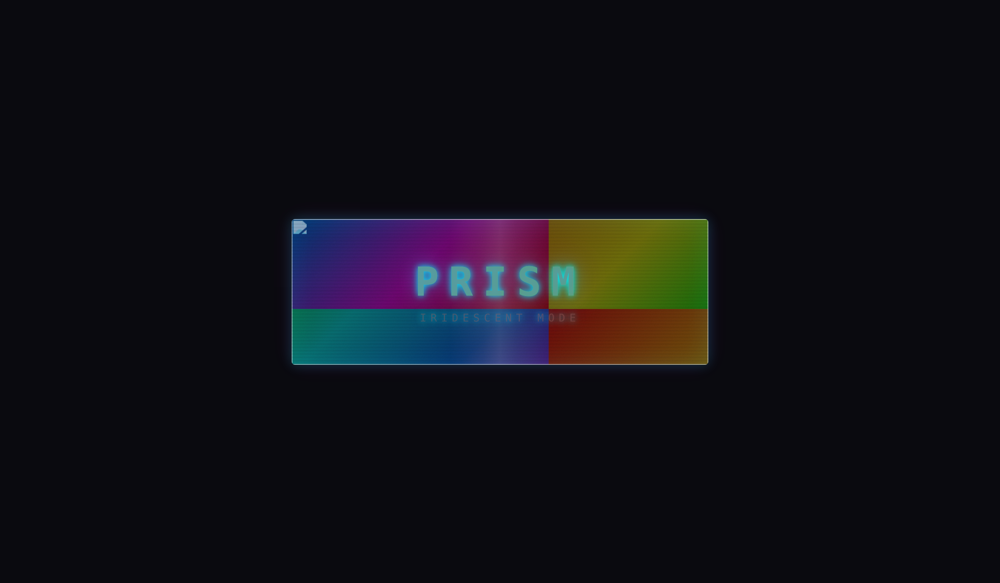

# react-holo

A React component that renders text and images with a **realistic hologram effect**, driven by device gyroscope or mouse input.



---

## Features

- **Holographic color conversion** — any background image is automatically re-graded to a holographic palette via CSS filters (grayscale → sepia → hue-rotate → saturate).
- **Gyroscope-driven interactivity** — reads `DeviceOrientationEvent` on mobile; falls back to mouse-position tracking on desktop.
- **9 layered visual effects** — scanlines, chromatic aberration, specular light-band, film-grain noise, glow, flicker, glitch, iridescent gradient overlay, and edge bloom — all GPU-accelerated.
- **5 color presets** — `cyan`, `green`, `magenta`, `gold`, `rainbow`; or pass any CSS color.
- **Accessible** — respects `prefers-reduced-motion`, uses appropriate ARIA attributes.
- **Tree-shakeable, zero runtime dependencies** — peer-depends on React ≥ 18 only.
- **TypeScript-first** — ships full type declarations and JSDoc on every export.

---

## Installation

```bash
npm install react-holo
```

> **Peer dependencies:** `react >= 18.0.0` and `react-dom >= 18.0.0`.

---

## Quick start

```tsx
import { Hologram } from 'react-holo';
import 'react-holo/style.css';

function App() {
  return (
    <Hologram>
      HELLO WORLD
    </Hologram>
  );
}
```

---

## With a background image

```tsx
<Hologram
  backgroundImage="/hero.jpg"
  color="magenta"
  intensity={0.9}
>
  <h1>Cyberpunk Title</h1>
</Hologram>
```

The background image is automatically converted to the holographic color palette. The `color` prop controls which hue family is used.


---

## Props

| Prop | Type | Default | Description |
|---|---|---|---|
| `children` | `ReactNode` | — | Content rendered inside the hologram. |
| `backgroundImage` | `string` | — | URL of a background image; converted to holographic colors automatically. |
| `color` | `HologramColorPreset \| string` | `'cyan'` | Color preset (`'cyan'`, `'green'`, `'magenta'`, `'gold'`, `'rainbow'`) or any CSS color. |
| `intensity` | `number` | `0.7` | Overall effect intensity (0–1). Controls hue-shift, parallax, chromatic aberration magnitude. |
| `scanlineSpeed` | `number` | `8` | Scanline scroll cycle duration in seconds. Lower = faster. |
| `flickerIntensity` | `number` | `0.3` | Random flicker strength (0–1). |
| `chromaticAberration` | `number` | `2` | RGB channel-split offset in pixels (0–5). |
| `glitch` | `boolean` | `true` | Enable/disable random glitch bursts. |
| `glitchInterval` | `[number, number]` | `[2000, 6000]` | Min/max interval (ms) between glitch events. |
| `interactive` | `boolean` | `true` | Track gyroscope / mouse to drive dynamic effects. Set `false` for a static hologram. |
| `className` | `string` | — | Extra CSS class on the root element. |
| `style` | `CSSProperties` | — | Inline styles on the root element. |

---

## Color presets

| Preset | Primary | Description |
|---|---|---|
| `cyan` | `#00f0ff` | Classic sci-fi hologram (default) |
| `green` | `#00ff41` | Matrix / retro terminal |
| `magenta` | `#ff00ff` | Vibrant neon pink |
| `gold` | `#ffd700` | Warm golden amber |
| `rainbow` | multi | Full-spectrum iridescent cycle |

You can also pass any valid CSS color (e.g. `'#ff4500'`, `'hotpink'`). The component will derive the hue automatically for the image filter and use the raw color for glows and text.



---

## Screenshots

### Large display

Cinematic heading — the kind you'd see floating in a sci-fi control room.



### Custom content (green preset)

The hologram container accepts arbitrary React content, not just text.



### Gold preset with background image



### Rainbow (iridescent) mode

Full-spectrum iridescent preset — cycles through the entire color wheel.



---

## How it works

### Visual layers (bottom → top)

1. **Background image** — filtered with `grayscale(0.8) brightness(1.3) contrast(1.1) sepia(1) hue-rotate(N) saturate(2)`.
2. **Gradient overlay** — multi-stop holographic gradient blended via `mix-blend-mode: screen`.
3. **Scanlines** — `repeating-linear-gradient` scrolling vertically.
4. **Light band** — specular highlight whose position follows the orientation input.
5. **Film-grain noise** — SVG `feTurbulence` rendered as a tiling background.
6. **Content** — children rendered with chromatic-aberration `text-shadow`, colored glow, and dynamic `hue-rotate`.

### Interactivity

On mobile, the component listens to `DeviceOrientationEvent` (beta/gamma axes). On desktop, it tracks the mouse position within the viewport. Raw values are normalized to `[-1, 1]` and smoothed with linear interpolation at 60 fps. The resulting vector drives:

- **Hue shift** — subtle color temperature change.
- **Parallax offset** — chromatic aberration direction.
- **Gradient angle** — iridescent gradient rotation.
- **Light-band position** — specular highlight sweep.

### Animations

- **Flicker** — randomized opacity noise at ~10 Hz.
- **Glitch** — periodic horizontal displacement + hue burst, triggered on a random interval.
- **Scanline scroll** — continuous vertical movement.

All animations respect `prefers-reduced-motion: reduce`.

---

## Storybook

```bash
npm run storybook
```

Opens the interactive component playground at `http://localhost:6006` with live controls for every prop.

Available stories:

| Story | Description |
|---|---|
| **Default** | Basic cyan hologram text with interactive controls |
| **WithBackgroundImage** | Demonstrates holographic image conversion |
| **ColorPresets** | Side-by-side comparison of all 5 presets |
| **LargeDisplay** | Cinematic large heading |
| **CustomContent** | Terminal-style status readout |
| **GoldWithBackground** | Gold preset with background image |
| **Static** | All animation/interaction disabled |
| **Rainbow** | Full-spectrum iridescent mode |

---

## Development

```bash
# Install dependencies
npm install

# Start Storybook dev server
npm run storybook

# Type-check
npm run lint

# Build library
npm run build
```

---

## Browser support

- Chrome / Edge 88+
- Firefox 90+
- Safari 15+
- Mobile Safari / Chrome (gyroscope support)

The component gracefully degrades: if the gyroscope API is unavailable it falls back to mouse tracking; if `mix-blend-mode` is unsupported the gradient overlay renders without blending.

---

## License

MIT
