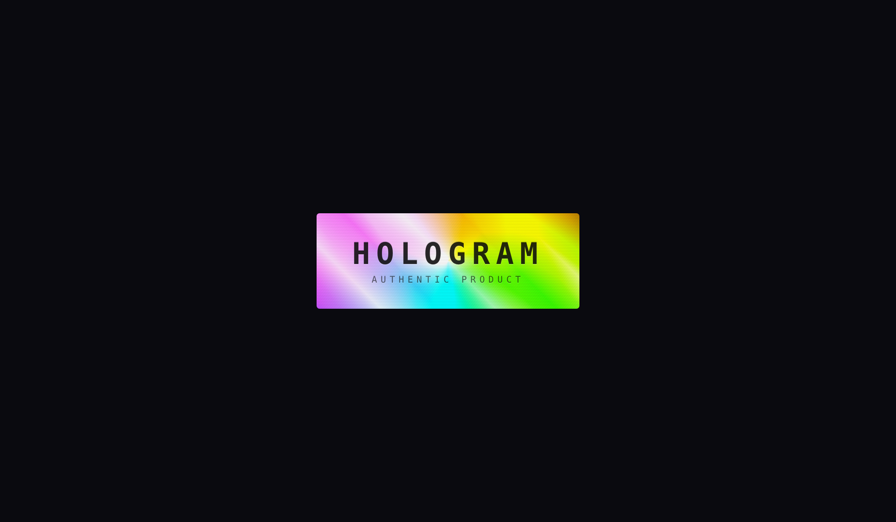
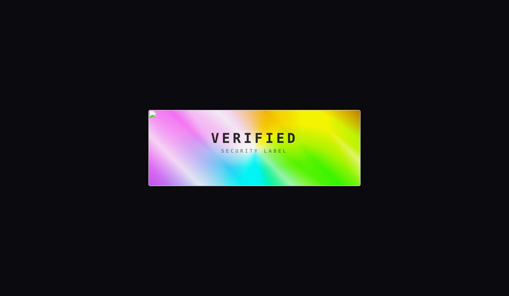
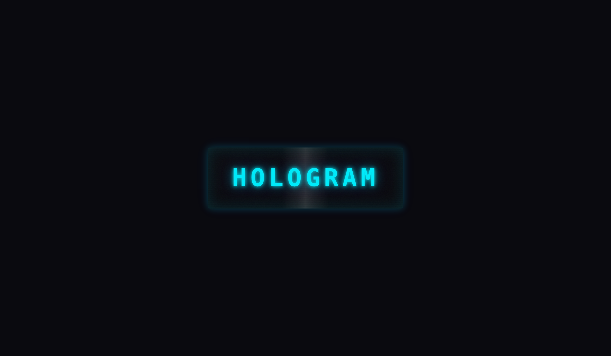
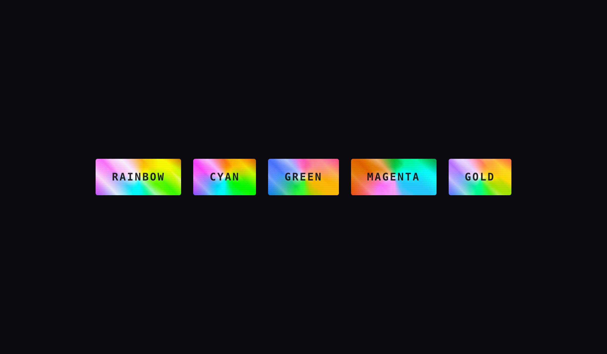
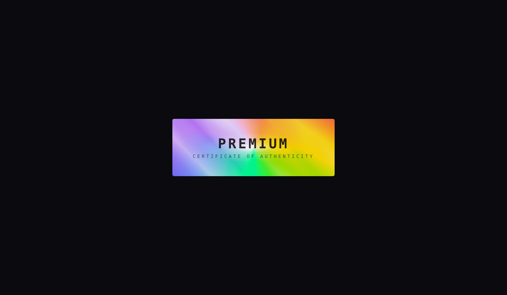
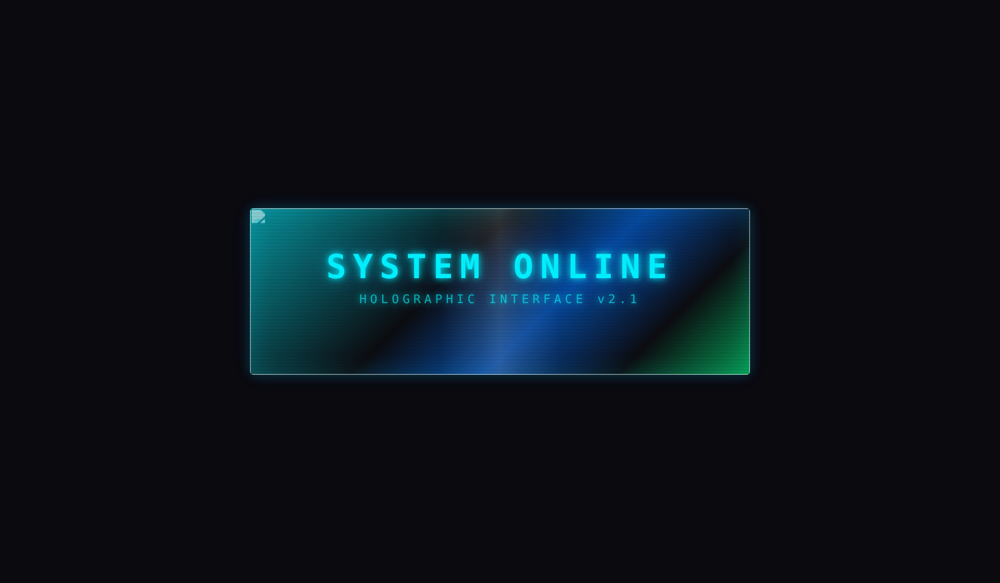
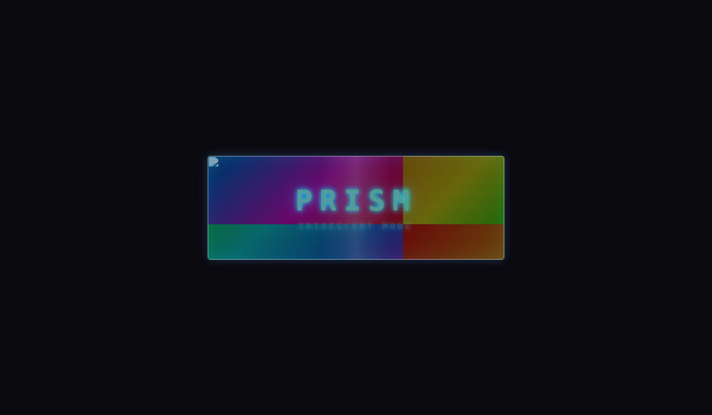

# react-holo

A React component that renders text and images with a **realistic hologram effect**, driven by device gyroscope or mouse input.



---

## Features

- **Two visual variants** — realistic holographic foil (`foil`) and sci-fi projected hologram (`beam`).
- **Holographic foil simulation** — conic rainbow diffraction, chrome metallic base, micro-line grating, specular highlight, and Fresnel edge glow — matching real-world holographic stickers.
- **Background image support** — in foil mode, images are blended via `multiply` (dark areas = ink, light areas = foil). In beam mode, images are re-graded to a holographic palette via CSS filters.
- **Gyroscope-driven interactivity** — reads `DeviceOrientationEvent` on mobile; falls back to mouse-position tracking on desktop.
- **5 color presets** — `rainbow`, `cyan`, `green`, `magenta`, `gold`; or pass any CSS color.
- **Accessible** — respects `prefers-reduced-motion`, uses appropriate ARIA attributes.
- **Tree-shakeable, zero runtime dependencies** — peer-depends on React ≥ 18 only.
- **TypeScript-first** — ships full type declarations and JSDoc on every export.

---

## Installation

```bash
npm install react-holo
```

> **Peer dependencies:** `react >= 18.0.0` and `react-dom >= 18.0.0`.

---

## Quick start

```tsx
import { Hologram } from 'react-holo';
import 'react-holo/style.css';

function App() {
  return (
    <Hologram>
      HOLOGRAM TEXT
    </Hologram>
  );
}
```

The default variant is `foil` — a realistic holographic material surface with dark text on top.

---

## Variants

### `variant="foil"` (default) — Realistic holographic material

Simulates real-world holographic foil / security-label material:

```tsx
<Hologram variant="foil" color="rainbow">
  <h1>AUTHENTIC PRODUCT</h1>
</Hologram>
```


Background images are blended via `mix-blend-mode: multiply` — dark areas of the image appear as "ink" printed on the foil, light areas reveal the rainbow beneath:

```tsx
<Hologram variant="foil" backgroundImage="/logo.png">
  <h1>VERIFIED</h1>
</Hologram>
```



### `variant="beam"` — Sci-fi projected hologram

Glowing text with chromatic aberration, scanlines, and edge bloom:

```tsx
<Hologram variant="beam" color="cyan">
  <h1>SYSTEM ONLINE</h1>
</Hologram>
```




---

## Props

| Prop | Type | Default | Description |
|---|---|---|---|
| `variant` | `'foil' \| 'beam'` | `'foil'` | Visual variant: realistic foil material or sci-fi projected hologram. |
| `children` | `ReactNode` | — | Content rendered inside the hologram. |
| `backgroundImage` | `string` | — | URL of a background image. Behavior depends on variant (see above). |
| `color` | `HologramColorPreset \| string` | `'rainbow'` (foil) / `'cyan'` (beam) | Color preset or any CSS color. |
| `intensity` | `number` | `0.7` | Overall effect intensity (0–1). |
| `scanlineSpeed` | `number` | `8` | Scanline scroll cycle duration in seconds. |
| `flickerIntensity` | `number` | `0.3` | Random flicker strength (0–1). |
| `chromaticAberration` | `number` | `2` | RGB channel-split offset in pixels (0–5). Primarily visible in beam variant. |
| `glitch` | `boolean` | `true` | Enable/disable random glitch bursts. |
| `glitchInterval` | `[number, number]` | `[2000, 6000]` | Min/max interval (ms) between glitch events. |
| `interactive` | `boolean` | `true` | Track gyroscope / mouse to drive dynamic effects. |
| `className` | `string` | — | Extra CSS class on the root element. |
| `style` | `CSSProperties` | — | Inline styles on the root element. |

---

## Color presets



| Preset | Foil behavior | Beam behavior |
|---|---|---|
| `rainbow` | Neutral silver base, full-spectrum rainbow (default for foil) | Animated rainbow gradient text |
| `cyan` | Cool silver-blue metallic base | Classic sci-fi cyan glow (default for beam) |
| `green` | Green-biased metallic base | Matrix / retro terminal |
| `magenta` | Pink/purple-biased metallic base | Vibrant neon pink glow |
| `gold` | Warm brass metallic base | Golden amber glow |

You can also pass any valid CSS color (e.g. `'#ff4500'`). The component derives the hue automatically.

---

## Screenshots

### Gold foil preset

Warm brass metallic base with gold-biased rainbow diffraction.



### Beam — terminal readout (green preset)

The hologram container accepts arbitrary React content, not just text.


### Beam — with background image

Background images are re-graded to a monochromatic holographic palette.



### Beam — rainbow (iridescent) mode



---

## How it works

### Foil variant — visual layers (bottom → top)

1. **Chrome metallic base** — multi-stop linear gradient (silver, gold, etc.).
2. **Conic rainbow diffraction** — `conic-gradient` covering the full spectrum, blended via `mix-blend-mode: color`.
3. **Secondary rainbow band** — offset linear gradient for spatial color variation, blended via `overlay`.
4. **Micro-line diffraction grating** — `repeating-linear-gradient` (1–2 px) simulating physical holographic foil texture.
5. **Specular highlight** — `radial-gradient` bright spot that follows device orientation.
6. **Fresnel edge glow** — perimeter brightening.
7. **Background image** — blended via `multiply` (dark = ink, light = foil).
8. **Content** — rendered in dark color with subtle emboss shadow.

### Beam variant — visual layers

1. **Background image** — filtered with `grayscale → sepia → hue-rotate → saturate`.
2. **Gradient overlay** — blended via `mix-blend-mode: screen`.
3. **Scanlines** — `repeating-linear-gradient` scrolling vertically.
4. **Light band** — specular highlight that follows orientation.
5. **Film-grain noise** — SVG `feTurbulence` tiling texture.
6. **Content** — chromatic-aberration `text-shadow`, colored glow, and dynamic `hue-rotate`.

### Interactivity

On mobile, the component listens to `DeviceOrientationEvent` (beta/gamma axes). On desktop, it tracks the mouse position within the viewport. Raw values are normalized to `[-1, 1]` and smoothed with linear interpolation at 60 fps. The resulting vector drives:

- **Conic gradient rotation** — rainbow color zone shifting (foil).
- **Specular highlight position** — bright spot follows tilt (foil).
- **Hue shift** — subtle color temperature change (beam).
- **Chromatic aberration direction** — RGB split follows tilt (beam).
- **Light-band position** — specular highlight sweep (beam).

### Animations

- **Flicker** — randomized opacity noise at ~10 Hz.
- **Glitch** — periodic horizontal displacement + hue burst, triggered on a random interval.
- **Scanline scroll** — continuous vertical movement.

All animations respect `prefers-reduced-motion: reduce`.

---

## Storybook

```bash
npm run storybook
```

Opens the interactive component playground at `http://localhost:6006` with live controls for every prop.

Available stories:

| Story | Variant | Description |
|---|---|---|
| **FoilDefault** | foil | Rainbow holographic foil with dark text |
| **FoilWithImage** | foil | Background image blended onto the foil |
| **FoilColorPresets** | foil | Side-by-side comparison of all 5 presets |
| **FoilGold** | foil | Gold metallic base preset |
| **BeamDefault** | beam | Classic cyan sci-fi hologram |
| **BeamWithImage** | beam | Background image with holographic color conversion |
| **BeamLargeDisplay** | beam | Cinematic large heading |
| **BeamTerminal** | beam | Green terminal-style status readout |
| **BeamRainbow** | beam | Full-spectrum iridescent mode |

---

## Development

```bash
# Install dependencies
npm install

# Start Storybook dev server
npm run storybook

# Type-check
npm run lint

# Build library
npm run build
```

---

## Browser support

- Chrome / Edge 88+
- Firefox 90+
- Safari 15+
- Mobile Safari / Chrome (gyroscope support)

The component gracefully degrades: if the gyroscope API is unavailable it falls back to mouse tracking; each foil layer is a separate DOM element for maximum browser compatibility.

---

## License

MIT
